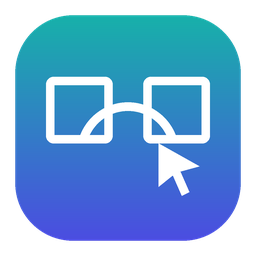
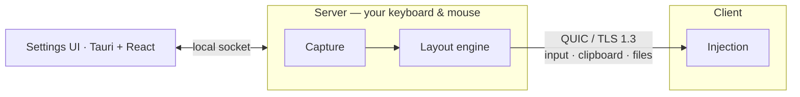

<div align="center">



# Glidedesk

**One keyboard and mouse for all your computers.**

Move the cursor off the edge of your Mac's screen and keep working on your Windows PC or Linux
machine. The clipboard and copied files follow the cursor. Everything travels encrypted over your
local network, and no account or cloud service is involved.

[](../../actions/workflows/ci.yml)
[](#license)


[Download](../../releases) · [Install](#install) · [Usage](#usage) · [Security](SECURITY.md) · [Contributing](CONTRIBUTING.md)

</div>

---

## Features

| | |
|---|---|
| 🖱️ **Seamless cursor** | Arrange computers and their monitors in a drag-and-drop layout; the cursor flows across edges, with guards against accidental switches. |
| ⌨️ **Native keyboard** | Keys act as on a keyboard plugged into the computer you control. ⌘ ↔ Ctrl translation between Mac and PC, per-computer overrides, media keys and extra mouse buttons. |
| 📋 **Shared clipboard** | Text, HTML, RTF and images follow the cursor. |
| 📁 **Copy & paste files** | Copy files on one computer and paste them on another with ⌘V / Ctrl+V. Nothing moves until you paste. There's no size limit, and free disk space is checked. |
| 🔍 **Zero configuration** | Clients find the server automatically (mDNS). You can also type a computer name or IP address. |
| 🔒 **Private by design** | QUIC with TLS 1.3 encryption. An optional password uses SPAKE2, so the password never crosses the network. Address allow and block lists. |
| 🧩 **One app** | Every computer can be the server or a client. Runs from the tray, starts at login, and has a portable mode on Windows. |
| ✍️ **Signed releases** | Signed installers, a minisign-signed `SHA256SUMS` and GitHub build-provenance attestations, with no paid accounts involved. |

## Supported systems

| System | Architecture | Release files |
|---|---|---|
| macOS 13 or later | Apple Silicon (arm64) | `Glidedesk_<ver>_macos-arm64.dmg` |
| Windows 10 22H2, Windows 11, Windows Server 2016 or later | x64 | `…_windows-x64-setup.exe`, `…-offline-setup.exe` (includes WebView2), `…-portable.zip` |
| Linux (X11 or Wayland¹) | x64, arm64 | `…_linux-<arch>.deb`, `.rpm`, `.tar.gz` |

¹ On Wayland, Linux can be a **client**. Sharing a Linux computer's own keyboard and mouse (the
server role) needs an X11 session until Wayland desktops offer an input-capture API.

## Install

Download the latest files from [**Releases**](../../releases). **Nightly** is always the latest
build of `main`.

<details open>
<summary><b>macOS</b></summary>

Open the `.dmg` and drag **Glidedesk** to Applications. On first launch, right-click the app and
choose **Open** (on macOS 15 and later: System Settings → Privacy & Security → Open Anyway). Then
click **Allow…** and turn Glidedesk on under **Accessibility**, the one permission Glidedesk
needs. On the Mac whose keyboard and mouse you share, also allow **Input Monitoring**
(*Advanced → macOS permissions*). It is optional, but without it an external mouse's gestures,
for example from Logi Options+, keep acting on the Mac while another computer has control.
</details>

<details>
<summary><b>Windows</b></summary>

Run the setup. The same file installs, **updates** (keeping your settings) and repairs.

- Silent install: `setup.exe /S [/D=C:\path] [/NORESTART]`. Exit code 3 means it installed with a
  warning, for example a firewall rule failed.
- **Portable:** unzip `…-portable.zip` anywhere, even onto a USB stick, and run `Glidedesk.exe`.
  Settings and logs stay in `Glidedesk Data` next to it.
</details>

<details>
<summary><b>Linux</b></summary>

```sh
sudo apt install ./Glidedesk_<ver>_linux-<arch>.deb     # Debian, Ubuntu
sudo dnf install ./Glidedesk_<ver>_linux-<arch>.rpm     # Fedora, RHEL
# or: tar xzf Glidedesk_<ver>_linux-<arch>.tar.gz && sudo ./install.sh
```

The package adds a udev rule so the signed-in user can create a virtual keyboard and mouse. The
computer needs this to be controlled, on Wayland too.
</details>

**Verify a download** (optional):

```sh
gh attestation verify <file> --repo <owner>/glidedesk
minisign -Vm SHA256SUMS -p minisign.pub && sha256sum -c SHA256SUMS
```

## Usage

1. **Pick a server.** This is the computer whose keyboard and mouse you use. In the first-run
   setup, choose **Server** there and **Client** on the others.
2. **Connect.** Clients find the server automatically. You can also enter the server's computer
   name (for example `Studio-Mac`) or IP address under *This computer → Server*.
3. **Arrange.** On the server, drag the computers around its screen in *Layout* to decide which
   edge leads where.
4. **Work.** Move the cursor across an edge. Copy on one computer and paste on another.

Optional settings:

- *Network → Password* lets only clients with the same password connect.
- *Network → Who may connect* limits which addresses may connect.
- *Computers → Settings* sets pointer speed, scrolling and ⌘/Ctrl swapping per computer.

Glidedesk starts at login, in the tray only. You can turn that off under *General → Start at
login*.

**Uninstall:**

- **Windows:** Settings → Apps.
- **macOS:** open **Uninstall Glidedesk** in the DMG, or use *Advanced → Uninstall*.
- **Linux:** use your package manager. Settings in `~/.config/glidedesk` are kept.

## How it works



The Rust workspace is split into small crates:

| Crate | Role |
|---|---|
| [`proto`](crates/proto) | Wire protocol: size-limited, length-prefixed `postcard` frames on QUIC streams |
| [`net`](crates/net) | QUIC transport, TLS, the optional SPAKE2 password, admission filters, mDNS discovery |
| [`layout`](crates/layout) | Screen layout and the engine that moves the cursor between machines |
| [`input`](crates/input) | Keyboard and mouse capture and injection for macOS, Windows and Linux (X11 and uinput) |
| [`clipboard`](crates/clipboard) | System clipboard (text, HTML, RTF, images, file lists) and format conversions |
| [`transfer`](crates/transfer) | Copying files and folders on paste, with safe paths and a free-space check |
| [`core`](crates/core) | Server hub, client runtime, clipboard sync, connection health |
| [`config`](crates/config) | Settings schema, protected atomic storage, migration, export and import |
| [`ipc`](crates/ipc) | Local protocol between the background agent and the UI |
| [`agent`](crates/agent) | Background agent (the same executable, run with `--agent`) and self-test |
| [`platform`](crates/platform) | OS helpers: host name, session and lock state, Wake-on-LAN |
| [`app`](app) | The desktop app: tray, windows, installers; the UI lives in [`app/ui`](app/ui) |
| [`xtask`](xtask) | Build and packaging automation (`cargo xtask package …`) |

## Build from source

Everything builds in Docker, so you only need Docker and a POSIX shell. macOS packages need the
macOS SDK, which Apple licenses for Apple hardware only: run `make sdk` once on a Mac.

```sh
scripts/local-ci.sh          # the full pipeline: tests → real agents → installers in output-build/
scripts/local-ci.sh test     # tests only (UI, rustfmt, cargo-deny, clippy, Rust tests, cross-checks)
docker/run.sh <command>      # any command inside the builder image, e.g. docker/run.sh cargo nextest run
make help                    # all shortcuts (build-win, build-mac, build-linux, lab, …)
```

Release signing keys are optional. `make signing-keys` creates a private `.signing/` directory
(never committed) and the public keys in [`signing/`](signing).

## CI and releases

A single workflow, [`.github/workflows/ci.yml`](.github/workflows/ci.yml), runs everything:

```text
pull request ─► test on Linux · Windows · macOS ─► "CI passed"
push to main ─► test ─► build installers (macOS, Windows, Linux x64/arm64) ─► Nightly pre-release
tag v*       ─► test ─► build installers ─────────────────────────────────► release
```

The test jobs run the UI checks, rustfmt, `cargo deny`, clippy and every Rust test (on macOS
including the real event-tap tests). They also start a real server and client, which connect,
survive client restarts and pass the self-test.

Nothing is built or published unless every test job passes. The workflow is hardened for a public
repository: read-only tokens by default, actions pinned to commit SHAs, no secrets for pull
requests or forks, signing keys confined to a protected `release` environment, and no caches in
release builds.

## Contributing

Contributions are welcome. See [CONTRIBUTING.md](CONTRIBUTING.md) and the
[Code of Conduct](CODE_OF_CONDUCT.md). Please report security issues privately, as described in
[SECURITY.md](SECURITY.md).

## License

Licensed under either of [Apache License 2.0](LICENSE-APACHE) or [MIT License](LICENSE-MIT), at
your option. Unless you explicitly state otherwise, any contribution intentionally submitted for
inclusion in Glidedesk by you, as defined in the Apache-2.0 license, shall be dual licensed as
above, without any additional terms or conditions.
